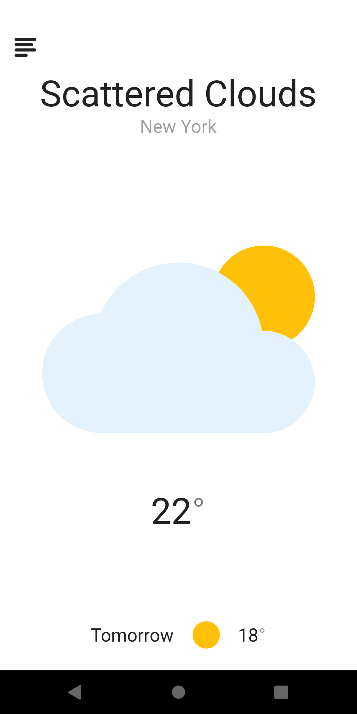

# Flutter Weather



## Table of Contents

- [About](#about)
- [Getting Started](#getting_started)
- [Usage](#usage)
- [Contributing](#contributing)

## About

A minimalistic weather app built as part of a portfolio item. The main purpose of this project is to learn Flutter and apply best practices to it. While the app is functional, it should only be used as a reference project.

## Getting Started

The project uses [OpenWeather](https://openweathermap.org/) API, you will need to get your own key and store it inside `secrets.json` file inside the `assets` directory. Here's an example of what the file should look like:

```
{
    "OpenWeatherApiKey": "Your Key"
}
```

## Contributing

PRs and Issues are welcomed. Just note that I won't be putting the app on Play Store.

## Credits

Design Inspiration: [Weather app Concept by Tung Tran](https://www.uplabs.com/posts/weather-app-concept-part-1)
